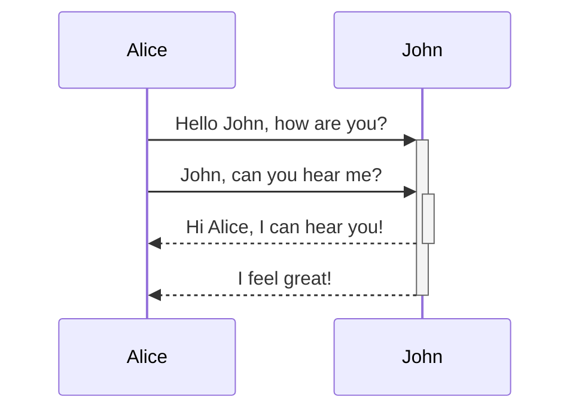
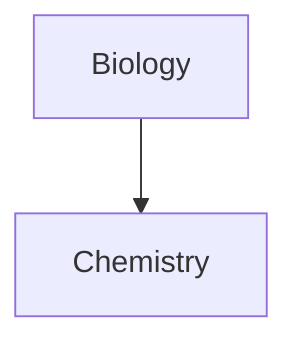

Obsidian uses [Mermaid](https://mermaid-js.github.io/) to render diagrams and charts. Mermaid also provides [a helpful live editor](https://mermaid-js.github.io/mermaid-live-editor).

````

````

```mermaid
sequenceDiagram
	Alice->>+John: Hello John, how are you?
    Alice->>+John: John, can you hear me?
    John->>-Alice: Hi Alice, I can hear you!
    John->>-Alice: I feel great!
````


Obsidian supports linking to notes in Mermaid:

```mermaid
graph TD

Biology --> Chemistry

class Biology,Chemistry internal-link;
```
````

An easier way to do it is the following:

````

````

This way, all the note names (at least until `Z[note name]`) are all automatically assigned the class `internal-link` when you use this snippet.

If you use special characters in your note names, you need to put the note name in double quotes.  
`"⨳ special character"`  
It looks like this if you follow the [second option](app://obsidian.md/Format%20your%20notes#^376b9d):  
`A["⨳ special character"]`